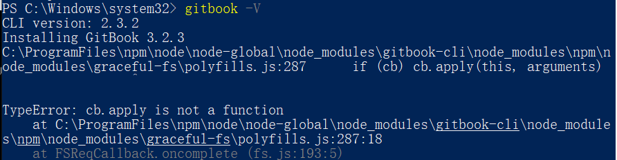

# gitbook 安装使用

## 1、注册账号

* gitbook官网地址：[https://www.gitbook.com/](https://www.gitbook.com/)
* 注册账号：[https://app.gitbook.com/join](https://app.gitbook.com/join)

注：需要翻墙

## 2、安装

### 1.安装 Node.js

gitbook 是一个基于 Node.js 的命令行工具

&#x20;下载地址：[http://nodejs.cn/download/](http://nodejs.cn/download/)

检查是否安装成功：

```
node -v
```

### 2.安装 gitbook

安装gitboo cli

```
npm install gitbook-cli -g
```

检查版本号并安装 gitbook

```
gitbook -V
```

报错

<figure><figcaption></figcaption></figure>

根据目录找到报错文件 polyfills.js，打开，找到 62\~64 行，全部注释掉

目录 C:\ProgramFiles\npm\node\node-global\node\_modules\gitbook-cli\node\_modules\npm\node\_modules\graceful-fs

<figure><figcaption></figcaption></figure>

保存，重新 gitbook -V，就可以安装了

### 3.初始化gitbook 项目

打开需要创建的指定目录

```
gitbook init
```

<figure><figcaption></figcaption></figure>

找到计算机上的目录C:\Users\Evie.gitbook\versions\3.2.3\lib，然后打开目录下的 init.js，找到第 72 行的代码：

```
return fs.writeFile(filePath, summary.toText(extension));
```

修改为

```
return summary.toText(extension).then(stx=>{return fs.writeFile(filePath, stx);});
```

<figure><figcaption></figcaption></figure>

保存，重新 gitbook init，就可以了

